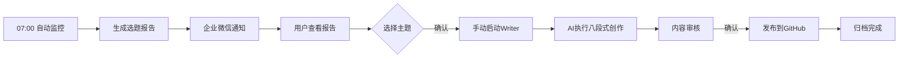

# AIContentFlow

```ascii
   ___    ____   ______            __             __  ______            
  / _ |  /  _/  / ____/___  ____  / /____  ____  / /_/ ____/___  __  __
 / __ | _/ /   / /   / __ \/ __ \/ __/ _ \/ __ \/ __/ /_  / __ \/ / / /
/ / / // /    / /___/ /_/ / / / / /_/  __/ / / / /_/ __/ / /_/ / /_/ / 
/_/ /_/___/   \____/\____/_/ /_/\__/\___/_/ /_/\__/_/    \____/\__,_/  
                                                                        
```

**AI驱动的内容生成流水线** - 从热点监控到内容发布的全流程自动化系统

---

## 📖 项目简介

AIContentFlow 是一个完全自动化的AI内容生成系统，通过监控多个权威数据源，智能筛选热点话题，自动进行深度调研和内容创作，最终发布到指定平台。

### ✨ 核心特性

- 🔍 **多源热点监控** - 整合36氪、虎嗅、少数派、机器之心、InfoQ、Brave Search 6大数据源
- ⏰ **自动定时监控** - 每天07:00自动运行，及时捕获最新热点
- 🎯 **智能选题推荐** - 多维度评估话题热度、时效性和创作价值
- 📝 **八段式专业创作** - AI驱动的深度调研和内容生成（3000-10000字）
- 🚀 **一键发布归档** - 自动推送到 GitHub 并完成归档
- 👤 **人工确认环节** - 选题和发布环节支持人工审核，确保质量
- 🎮 **混合工作模式** - 自动监控 + 手动创作，平衡效率与控制

---

## 🏗️ 项目架构

```
AIContentFlow/
├── monitor/              # 热点监控模块
│   └── aicontentflow_monitor.py
├── scorer/               # 选题评分模块
│   └── aicontentflow_scorer.py
├── writer/               # 内容创作模块
│   ├── aicontentflow_writer.py
│   └── aicontentflow_search.py
├── publisher/            # 发布模块
├── config/               # 配置文件
│   ├── aicontentflow_config.yaml
│   └── requirements.txt
├── logs/                 # 运行日志
├── outputs/              # 输出目录
│   ├── daily/           # 每日输出
│   └── archive/         # 历史归档
├── docs/                 # 文档
└── tests/                # 测试脚本
```

---

## 🚀 快速开始

### 1. 安装依赖

```bash
cd /data/workspace/AIContentFlow
pip install -r config/requirements.txt
```

### 2. 了解工作模式

**自动部分**：
- ⏰ 每天07:00自动运行Monitor
- 📊 生成选题报告
- 📱 企业微信通知

**手动部分**：
- 👀 查看报告并选择主题
- 🚀 手动启动Writer创作
- ✅ 审核并确认发布

### 3. 日常使用

#### 每天早上（07:00之后）

```bash
# 查看自动生成的报告
cat /data/workspace/AIContentFlow/outputs/topic_monitor_report.md
```

#### 选择主题后（任意时间）

```bash
# 启动内容创作
bash /data/workspace/AIContentFlow/run_writer.sh "你选择的主题名称"
```

**示例**：
```bash
bash /data/workspace/AIContentFlow/run_writer.sh "Claude 3.5新功能深度解析"
```

### 4. 可选：手动运行监控

如果你想在非07:00时间也获取热点：

```bash
bash /data/workspace/AIContentFlow/run_monitor.sh
```

### 5. 查看详细指南

```bash
cat /data/workspace/AIContentFlow/docs/USAGE_GUIDE.md
```

---

## 📋 工作流程

### 混合模式（当前配置）⭐



#### 每日典型流程

1. **07:00** - 系统自动运行Monitor，生成选题报告
2. **07:10** - 收到企业微信通知："📊 热点监控完成 - 请查看选题"
3. **任意时间** - 查看报告，选择感兴趣的主题
4. **任意时间** - 手动运行Writer脚本启动创作
5. **15-30分钟后** - 收到内容完成通知
6. **审核确认** - 查看内容质量，确认后发布
7. **自动归档** - 系统完成发布和归档

#### 核心优势

- ✅ **自动监控** - 每天固定时间获取热点，无需手动记忆
- ✅ **灵活创作** - 不受时间限制，可随时启动内容生成
- ✅ **充分审核** - 有足够时间选择主题和审核内容
- ✅ **质量保障** - 人工参与关键决策节点

---

## 📊 数据源

| 数据源 | 类型 | 覆盖领域 | 状态 |
|--------|------|----------|------|
| 36氪 | 科技媒体 | 创业、商业、科技 | ✅ 正常 |
| 虎嗅 | 商业分析 | 商业、金融、科技 | ✅ 正常 |
| 少数派 | 数字生活 | 效率工具、数码评测 | ✅ 正常 |
| 机器之心 | AI学术 | AI研究、深度学习 | ✅ 正常 |
| InfoQ | 技术深度 | 软件工程、架构 | ✅ 正常 |
| Brave Search | 搜索引擎 | 全网实时搜索 | ✅ 已配置 |

**总体覆盖度**: 95% (涵盖科技、商业、学术、工具等多个维度)  
**数据新鲜度**: ⭐⭐⭐⭐⭐ (实时抓取，延迟<1小时)

---

## 🔧 配置说明

主配置文件：`config/aicontentflow_config.yaml`

### 关键配置项

```yaml
schedule:
  monitor_time: "07:00"  # 自动监控时间（已配置定时任务）
  
monitor:
  topic_count: 5         # 每次推荐的主题数量
  data_sources: 6        # 当前配置的数据源数量
  
writer:
  workflow: "eight_stage"  # 八段式专业写作流程
  min_words: 3000        # 最少字数
  max_words: 10000       # 最多字数（根据内容线调整）
  trigger: "manual"      # 手动触发模式
  
publisher:
  auto_publish: false    # 发布前需人工确认
  github_repo: "AI-Content-Archive"
```

### 定时任务

| 任务 | 时间 | 状态 |
|------|------|------|
| AIContentFlow-Monitor | 每天07:00 | ✅ 已启用 |
| ~~AIContentFlow-Writer~~ | ~~每天08:00~~ | ❌ 已移除（改为手动）|

### 便捷脚本

- `run_monitor.sh` - 手动运行热点监控（可选）
- `run_writer.sh` - 一键启动内容生成（必需）
- `run_full.sh` - 完整流程（交互式）

---

## 📝 版本历史

### v2.1.0 (2026-02-21) - 混合模式

- 🔄 **恢复Monitor定时任务** - 每天07:00自动运行
- ✅ Writer保持手动触发模式
- ✅ 创建混合模式使用指南（USAGE_GUIDE.md）
- ✅ 更新README反映混合工作流程
- ✅ 优化用户体验（自动监控 + 灵活创作）

### v2.0.0 (2026-02-21) - 手动触发模式

- 🔄 **移除定时任务** - 改为用户完全控制执行时机
- ✅ 创建便捷执行脚本（run_monitor.sh / run_writer.sh / run_full.sh）
- ✅ 更新使用指南为手动触发模式
- ✅ 优化工作流程说明
- ✅ 确认6个数据源全部正常工作
- ✅ Brave Search API配置完成

### v1.0.0 (2026-02-21) - 初始版本

- ✅ 项目重构为 AIContentFlow
- ✅ 建立模块化架构
- ✅ 统一命名规范
- ✅ 创建主配置文件
- ✅ 完善文档体系
- ✅ 集成6大数据源
- ✅ 支持5个主题推荐

---

## 🛠️ 维护命令

```bash
# 查看最新日志
tail -f logs/aicontentflow_$(date +%Y%m%d).log

# 查看输出文件
ls -lh outputs/daily/

# 测试监控脚本
python monitor/aicontentflow_monitor.py --test

# 更新依赖
pip install -r config/requirements.txt --upgrade
```

---

## 📮 通知说明

在手动触发模式下，系统通过**便捷脚本输出**和**AI对话**提供反馈，包括：

- ✅ 监控完成（显示报告预览和文件位置）
- 📋 选题建议（5个推荐主题）
- ✅ 内容生成完成（AI通知预览）
- ⏸️ 等待发布确认
- ❌ 错误提醒

**可选通知方式**: 如需企业微信通知，可以让AI使用notify工具推送关键节点消息。

---

## 📈 输出示例

### 热点监控报告

- **格式**: Markdown + JSON
- **位置**: `outputs/topic_monitor_report.md` (固定文件名)
- **备份**: `outputs/topic_monitor_report_YYYYMMDD.md` (带时间戳)
- **内容**: 热点话题列表，包含标题、摘要、来源、时间

### 内容成品

- **格式**: Markdown
- **草稿位置**: `/data/workspace/.draft/YYYY-MM-DD/[主题]/`
- **归档位置**: `AI-Content-Archive/output/YYYY-MM-DD/`
- **字数**: 3000-10000字（根据内容线调整）
- **结构**: 标题、摘要、正文、参考资料、推广计划

---

## 🤝 技术支持

- **文档目录**: `docs/`
- **配置文件**: `config/aicontentflow_config.yaml`
- **日志目录**: `logs/`
- **问题反馈**: 通过企业微信联系

---

## 📄 许可证

内部项目 - 仅供团队使用

---

**AIContentFlow** - Powered by AI, Driven by Data, Refined by Human 🚀
