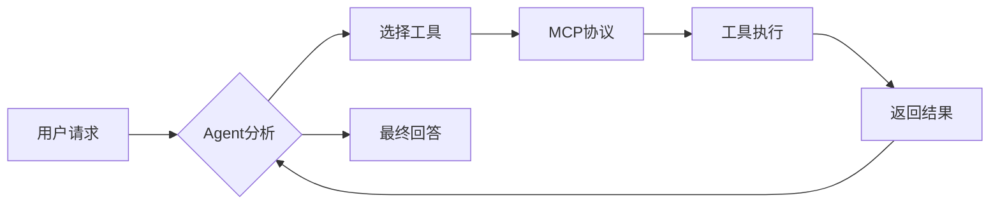

# AI Agent生态的四大基石：深入理解Agent、MCP、Rules与Skills

> **导读**：在AI应用从"对话工具"向"自主智能体"演进的过程中，Agent、MCP、Rules、Skills四个概念频繁出现却常被混淆。本文将深入剖析这四者的本质、关系与实践，帮助开发者构建更强大的AI应用。

---

## 📖 目录

1. [从单一模型到智能生态：AI Agent的演进之路](#chapter1)
2. [Agent：会思考、能行动的AI智能体](#chapter2)
3. [MCP：连接AI与外部世界的标准协议](#chapter3)
4. [Rules：让AI输出符合你的规范](#chapter4)
5. [Skills：可复用的工作流知识包](#chapter5)
6. [四者协同：构建完整AI Agent生态](#chapter6)
7. [实战指南：从零搭建你的第一个Agent系统](#chapter7)
8. [最佳实践与避坑指南](#chapter8)

---

<a name="chapter1"></a>
## 一、从单一模型到智能生态：AI Agent的演进之路

### 1.1 AI应用的三个发展阶段

**阶段1：问答型AI（2022-2023）**

```plaintext
用户 → ChatGPT → 回答
```

特点：
- 纯文本输入输出
- 依赖模型训练数据
- 无法执行实际操作
- 知识截止日期固定

**阶段2：工具增强型AI（2023-2024）**

```plaintext
用户 → AI + Function Calling → 调用外部API → 返回结果
```

特点：
- 能调用搜索、计算器等工具
- 可访问实时数据
- 仍需人工设计工具集
- 缺乏统一标准

**阶段3：自主智能体生态（2024-现在）**

```plaintext
用户意图
   ↓
Agent（规划+执行）
   ↓
MCP协议 ← 连接 → 数百种工具/数据源
   ↓
Skills动态加载 ← 按需 → 专业工作流
   ↓
Rules约束 ← 保证 → 输出质量
```

特点：
- 自主规划任务流程
- 标准化工具接入
- 可复用的专业能力
- 输出质量可控

### 1.2 为什么需要Agent生态？

**痛点1：传统AI应用的"信息孤岛"**

```python
# 传统方式：每个应用重复对接工具
class MyAIApp:
    def __init__(self):
        self.github_api = GitHubClient()
        self.jira_api = JiraClient()
        self.slack_api = SlackClient()
        # 每个应用都要写一遍...
```

**解决方案：MCP统一接口**

```python
# MCP方式：一次开发，处处可用
mcp_server = MCPServer()
mcp_server.register_tool("github", github_handler)
# 所有支持MCP的AI应用都能自动使用
```

**痛点2：AI输出质量不稳定**

```plaintext
❌ 问题场景：
用户："帮我写一个Python函数"
AI输出：
- 没有类型注解
- 缺少文档字符串
- 命名风格混乱
- 不符合PEP 8规范
```

**解决方案：Rules预设规范**

```markdown
# Python编码Rules
1. 必须使用类型注解（Type Hints）
2. 函数必须包含Docstring
3. 变量命名遵循snake_case
4. 每个函数不超过50行
```

**痛点3：复杂工作流难以复用**

```plaintext
❌ 每次都要重复指导：
"先调研竞品 → 整理成表格 → 生成SWOT分析 → 输出PPT格式"
```

**解决方案：Skills封装流程**

```markdown
# competitive-analysis.skill
name: competitive-analysis
description: 竞品分析工作流

## 执行步骤
1. 使用web_search搜索竞品信息
2. 提取关键指标并制表
3. 生成SWOT分析矩阵
4. 输出Markdown格式报告
```

---

<a name="chapter2"></a>
## 二、Agent：会思考、能行动的AI智能体

### 2.1 什么是AI Agent？

**核心定义**：
> AI Agent = 大语言模型（LLM）+ 规划能力 + 工具调用 + 记忆系统

用一个类比理解：

```plaintext
传统AI ≈ 图书馆管理员
- 只能回答"书在哪里"
- 需要你自己去找书

AI Agent ≈ 个人助理
- 理解你的需求（"我需要研究量子计算"）
- 自主规划（先找综述论文 → 再找最新研究 → 整理成报告）
- 执行操作（搜索、下载、整理、写作）
- 主动汇报进展
```

### 2.2 Agent的核心能力

#### 能力1：自主规划（Planning）

**示例：用户请求分解**

```python
# 用户输入
"帮我分析GitHub上最热门的AI Agent项目"

# Agent内部规划（ReAct思维链）
Thought 1: 需要访问GitHub搜索API
Action 1: 调用MCP工具 github.search_repos(topic="ai-agent", sort="stars")
Observation 1: 获得Top 10项目列表

Thought 2: 需要分析每个项目的技术栈
Action 2: 对每个项目调用 github.get_repo_details()
Observation 2: 获取README、技术栈、Star趋势

Thought 3: 整理成结构化报告
Action 3: 生成Markdown表格 + 可视化图表
Final Answer: [输出完整分析报告]
```

#### 能力2：工具调用（Tool Use）

**工具类型分类**：

| 工具类型 | 示例 | 实现方式 |
|---------|------|---------|
| 数据查询 | 搜索引擎、数据库 | MCP Server |
| 内容创作 | 画图、视频生成 | 专用API |
| 代码执行 | Python解释器 | 沙盒环境 |
| 办公协作 | Jira、Slack | MCP Server |
| 文件操作 | 读写文件、Git操作 | 本地工具 |

**调用流程**：



#### 能力3：长期记忆（Memory）

```python
class AgentMemory:
    def __init__(self):
        self.short_term = []  # 当前对话上下文
        self.long_term = {}   # 持久化知识
        self.episodic = []    # 历史任务记录
    
    def remember_preference(self, key, value):
        """记住用户偏好"""
        self.long_term[f"preference.{key}"] = value
    
    def recall_similar_task(self, current_task):
        """检索相似历史任务"""
        # 向量相似度搜索
        return self.episodic.search(current_task)
```

**实际应用**：

```plaintext
第1次对话：
用户："帮我写Python代码，我喜欢用type hints"
Agent：[生成带类型注解的代码] + 记住偏好

第100次对话：
用户："帮我写一个排序函数"
Agent：[自动使用type hints] ✨ 因为记住了你的习惯
```

### 2.3 Agent的两种架构模式

#### 模式1：ReAct（推理+行动）

```python
while not task_completed:
    # 思考（Reasoning）
    thought = llm.generate(f"当前状态: {state}, 下一步该做什么?")
    
    # 行动（Acting）
    if "需要调用工具" in thought:
        action = parse_action(thought)
        observation = execute_tool(action)
        state.update(observation)
    else:
        final_answer = thought
        break
```

**优点**：透明可解释、易调试  
**缺点**：速度较慢（每步都要调用LLM）

#### 模式2：Plan-and-Execute（规划执行）

```python
# 阶段1：一次性规划
plan = llm.generate(f"任务: {task}, 请生成完整执行计划")
# 输出：["步骤1: 搜索资料", "步骤2: 数据分析", "步骤3: 生成报告"]

# 阶段2：批量执行
for step in plan:
    result = execute_step(step)
    if result.failed:
        replan()  # 失败时重新规划
```

**优点**：效率高、支持并行  
**缺点**：灵活性稍差

---

<a name="chapter3"></a>
## 三、MCP：连接AI与外部世界的标准协议

### 3.1 MCP的诞生背景

**问题：AI工具集成的"碎片化"**

```plaintext
2023年以前的困境：
- OpenAI有自己的Plugin标准
- Google有自己的Extension标准
- 微软有Copilot Plugin标准
- 每个平台都要重新开发一遍工具 😫
```

**Anthropic的解决方案：Model Context Protocol (MCP)**

> MCP是一个开放协议，定义了AI模型与外部工具/数据源的标准化交互方式。

**类比理解**：

```plaintext
MCP ≈ USB协议
- USB出现前：每个设备都有专用接口（并口、串口、PS/2...）
- USB出现后：一个接口接入所有设备

MCP出现前：每个AI应用对接工具都要写专用代码
MCP出现后：开发一次，所有MCP兼容的AI应用都能用
```

### 3.2 MCP协议的核心概念

#### 概念1：MCP Server（工具提供方）

**标准接口定义**：

```python
from mcp import Server, Tool

class GitHubMCPServer(Server):
    def list_tools(self) -> List[Tool]:
        """声明此Server提供的所有工具"""
        return [
            Tool(
                name="search_repos",
                description="搜索GitHub仓库",
                input_schema={
                    "type": "object",
                    "properties": {
                        "query": {"type": "string"},
                        "sort": {"type": "string", "enum": ["stars", "forks"]}
                    }
                }
            ),
            Tool(name="get_repo_info", ...),
            Tool(name="create_issue", ...)
        ]
    
    def call_tool(self, name: str, arguments: dict):
        """执行具体工具调用"""
        if name == "search_repos":
            return self.github_api.search(**arguments)
```

#### 概念2：MCP Client（AI应用方）

```python
class AgentWithMCP:
    def __init__(self):
        self.mcp_client = MCPClient()
        # 连接多个MCP Server
        self.mcp_client.connect("github", "http://mcp.example.com/github")
        self.mcp_client.connect("jira", "http://mcp.example.com/jira")
    
    def execute_task(self, user_query):
        # 1. LLM决策要调用哪个工具
        decision = self.llm.plan(user_query, available_tools=self.mcp_client.list_all_tools())
        
        # 2. 通过MCP协议调用工具
        result = self.mcp_client.call_tool(
            server="github",
            tool="search_repos",
            arguments={"query": "ai-agent", "sort": "stars"}
        )
        
        # 3. 将结果返回给LLM处理
        return self.llm.synthesize(result)
```

#### 概念3：传输方式

MCP支持三种传输协议：

| 传输方式 | 使用场景 | 示例 |
|---------|---------|------|
| **STDIO** | 本地进程通信 | `node mcp-server.js` |
| **SSE** (Server-Sent Events) | 远程HTTP服务 | `http://mcp.example.com/sse` |
| **Streamable HTTP** | 高性能远程调用 | `http://mcp.example.com/stream` |

**MCP配置示例**：

```json
{
  "mcpServers": {
    "local-tool": {
      "command": "python",
      "args": ["-m", "my_mcp_server"],
      "transportType": "stdio"
    },
    "remote-github": {
      "url": "https://mcp.woa.com/github/sse",
      "transportType": "sse",
      "headers": {
        "Authorization": "Bearer <token>"
      }
    }
  }
}
```

### 3.3 MCP的数据流

**完整调用流程**：

```plaintext
[AI Agent] 
   ↓ (1) 发起请求
   ↓ {"method": "tools/list"}
[MCP Client]
   ↓ (2) 转发请求
   ↓ HTTP/SSE/STDIO
[MCP Server]
   ↓ (3) 返回工具列表
   ↓ [{"name": "search", ...}]
[MCP Client]
   ↓ (4) 解析并缓存
[AI Agent]
   ↓ (5) LLM决策调用search
   ↓ {"method": "tools/call", "params": {"name": "search", "arguments": {...}}}
[MCP Client]
   ↓ (6) 执行调用
[MCP Server]
   ↓ (7) 执行实际操作
   ↓ {"result": [...]}
[MCP Client]
   ↓ (8) 返回结果
[AI Agent]
   ↓ (9) 生成最终回答
```

**协议消息示例**：

```json
// 1. 初始化连接
{
  "jsonrpc": "2.0",
  "method": "initialize",
  "params": {
    "protocolVersion": "2024-11-05",
    "capabilities": {}
  }
}

// 2. 列出工具
{
  "jsonrpc": "2.0",
  "method": "tools/list",
  "id": 1
}

// 3. Server响应
{
  "jsonrpc": "2.0",
  "id": 1,
  "result": {
    "tools": [
      {
        "name": "github_search",
        "description": "搜索GitHub仓库",
        "inputSchema": {
          "type": "object",
          "properties": {
            "query": {"type": "string"}
          },
          "required": ["query"]
        }
      }
    ]
  }
}

// 4. 调用工具
{
  "jsonrpc": "2.0",
  "method": "tools/call",
  "id": 2,
  "params": {
    "name": "github_search",
    "arguments": {
      "query": "ai-agent"
    }
  }
}
```

### 3.4 MCP的实战价值

#### 价值1：一次开发，多处使用

```python
# 开发一个Jira MCP Server
class JiraMCPServer(Server):
    def list_tools(self):
        return [
            Tool("create_issue", ...),
            Tool("list_projects", ...),
            Tool("update_status", ...)
        ]

# 立即可用于：
✅ Claude Desktop
✅ 自研AI应用
✅ 任何支持MCP的平台
```

#### 价值2：安全性

```python
# MCP Server运行在本地/内网
# 敏感数据不经过第三方AI平台

[AI应用] <--仅传输工具调用指令--> [本地MCP Server]
                                        ↓
                                   [访问内网数据库]
```

#### 价值3：可组合性

```json
{
  "agent": "全能助手",
  "mcp_servers": [
    "github",      // 代码管理
    "jira",        // 项目管理
    "slack",       // 沟通协作
    "notion",      // 文档管理
    "database"     // 数据查询
  ]
}
// Agent可自主组合这些工具完成复杂任务
```

---


<a name="chapter4"></a>
## 四、Rules：让AI输出符合你的规范

### 4.1 为什么需要Rules？

**问题场景**：

```plaintext
❌ 无Rules的混乱现状

用户1："帮我写Python代码"
AI：[生成没有类型注解的代码]

用户2："帮我写Python代码"  
AI：[生成有类型注解但没有文档的代码]

用户3："帮我写Python代码"
AI：[生成风格完全不同的代码]

结果：团队代码风格混乱，维护成本高
```

```plaintext
✅ 使用Rules后的一致性

所有用户 + Python编码Rules
AI：[统一生成符合规范的代码]
- 必有类型注解
- 必有Docstring
- 统一命名风格
- 统一缩进规则
```

### 4.2 Rules的本质

**核心定义**：
> Rules = 用户自定义的约束条件，用于规范AI的输出行为

**与Prompt的区别**：

| 维度 | System Prompt | Rules |
|------|---------------|-------|
| **作用域** | 全局生效 | 按需加载 |
| **修改权限** | Agent创建者 | Agent使用者 |
| **典型内容** | 角色定义、基本能力 | 具体规范、偏好设置 |
| **示例** | "你是一个Python专家" | "代码必须符合PEP 8" |

**类比理解**：

```plaintext
System Prompt = 公司规章制度（所有员工遵守）
Rules = 部门工作手册（本部门特有规范）

示例：
System Prompt: "你是一个编程助手，帮用户写代码"
Python团队Rules: "必须使用type hints + black格式化"
前端团队Rules: "必须使用ESLint + Prettier"
```

### 4.3 Rules的应用场景

#### 场景1：编码规范统一

```markdown
# Python编码Rules

## 1. 类型注解
所有函数必须包含参数和返回值的类型注解

## 2. 文档字符串
格式：Google Style Docstring
必须包含：简介、参数说明、返回值说明、异常说明

## 3. 命名规范
- 变量/函数：snake_case
- 类名：PascalCase
- 常量：UPPER_SNAKE_CASE
- 私有成员：_leading_underscore

## 4. 代码组织
- 每个函数不超过50行
- 每个文件不超过500行
- 导入语句按stdlib → 第三方 → 本地顺序排列

## 5. 禁止事项
❌ 不使用eval()、exec()
❌ 不使用可变默认参数
❌ 不使用from module import *

## 6. 示例
✅ 正确示例：
```python
def calculate_average(numbers: List[float]) -> float:
    """计算数字列表的平均值。
    
    Args:
        numbers: 数字列表，必须非空
        
    Returns:
        平均值
        
    Raises:
        ValueError: 当列表为空时
    """
    if not numbers:
        raise ValueError("列表不能为空")
    return sum(numbers) / len(numbers)
```

❌ 错误示例：
```python
def calc(nums):  # 缺少类型注解和文档
    return sum(nums)/len(nums)  # 没有异常处理
```

#### 场景2：内容生成规范

```markdown
# 技术博客写作Rules

## 结构要求
1. 必须包含：标题、导读、目录、正文、总结
2. 每个章节必须有2-3级子标题
3. 文章长度：3000-5000字

## 语言风格
- 使用第二人称（"你"）拉近距离
- 避免过度使用专业术语
- 每个技术概念必须配有通俗比喻
- 禁止使用"显而易见"、"众所周知"等表达

## 格式规范
- 代码块必须标注语言类型
- 重要概念使用**加粗**
- 关键命令使用`代码标记`
- 每个章节至少包含一个示例

## 降AI味要求
❌ 避免使用：
- "在当今社会"、"随着...的发展"
- "值得注意的是"、"需要强调的是"
- "综上所述"、"总而言之"
- 过度使用emoji

✅ 推荐使用：
- 直接陈述事实
- 具体数据支撑观点
- 真实案例说明
- 自然的口语化表达

## 示例对比
❌ AI味浓重：
"随着人工智能技术的飞速发展，AI Agent已经成为当下最热门的技术趋势之一。值得注意的是，
MCP协议的出现，为AI生态系统带来了革命性的变化。综上所述，我们可以得出结论..."

✅ 自然表达：
"2024年，AI Agent从概念变成了实际产品。为什么？因为MCP解决了工具接入混乱的问题——
就像USB统一了电脑接口一样。让我们看看它是如何做到的..."
```

#### 场景3：业务流程规范

```markdown
# 客服对话Rules

## 回复模板
1. 问候：称呼用户昵称
2. 理解确认：复述用户问题
3. 解决方案：提供2-3个选项
4. 结束语：询问是否还有其他问题

## 禁止行为
❌ 直接说"不能"、"不可以"
✅ 改为"目前我们支持...，您也可以尝试..."

❌ 使用专业术语
✅ 用通俗语言解释

❌ 冷冰冰的官方回复
✅ 添加适当emoji，展现亲和力

## 异常处理
- 无法解答时：引导转人工客服
- 用户情绪激动：先安抚情绪再解决问题
- 涉及敏感信息：严格按隐私政策执行

## 示例
用户："为什么我的订单还没发货？"

❌ 错误回复：
"您的订单正在处理中，请耐心等待。"

✅ 正确回复：
"李先生，您好！我看到您的订单123456确实还未发货😊

目前情况是：
1️⃣ 您的商品已通过质检
2️⃣ 预计今天下午3点前打包完成
3️⃣ 明天上午10点前会送到您手上

我已帮您加急备注，如果明天中午前还未收到，请直接联系我哦！

还有其他问题吗？"
```

### 4.4 Rules的技术实现

#### Rules配置示例

```json
{
  "agent_id": "code_assistant",
  "rules": [
    {
      "id": "python_standards",
      "content": "[上述Python编码规范]",
      "enabled": true,
      "priority": 2
    },
    {
      "id": "security_check",
      "content": "禁止生成包含硬编码密钥的代码",
      "enabled": true,
      "priority": 1
    }
  ]
}
```

#### Rules的优先级

```plaintext
优先级（从高到低）：
1. 用户当前对话的临时指令
2. Rules（用户自定义规范）
3. System Prompt（Agent基础设定）
4. 模型默认行为
```

**示例冲突处理**：

```plaintext
System Prompt: "尽量简洁回答"
Rules: "每个函数必须包含详细文档"
用户指令: "写一个排序函数"

最终结果：
✅ 函数本身简洁（遵循System Prompt）
✅ 但包含完整文档（遵循Rules）
✅ 针对用户具体需求（遵循用户指令）
```

### 4.5 编写高质量Rules的技巧

#### 技巧1：使用正反示例

```markdown
❌ 模糊规则：
"代码要清晰易读"

✅ 具体规则：
"禁止嵌套超过3层的if语句"

## 示例
❌ 难以维护的代码：
if condition1:
    if condition2:
        if condition3:
            if condition4:
                return "太深了！"

✅ 重构后的代码：
def check_conditions():
    if not condition1:
        return False
    if not condition2:
        return False
    if not condition3:
        return False
    return condition4
```

#### 技巧2：分层组织Rules

```markdown
# Rules层级结构

## 🔴 强制规则（Mandatory）
违反则输出无效
- 必须包含类型注解
- 禁止使用eval()

## 🟡 推荐规则（Recommended）
尽量遵守
- 函数长度控制在50行内
- 使用列表推导式替代简单循环

## 🟢 风格规则（Stylistic）
可灵活调整
- 单引号 vs 双引号
- 行末是否加逗号
```

#### 技巧3：Rules可维护性

```markdown
# Rules版本管理

## Version 1.0 (2024-01-01)
- 初始版本

## Version 1.1 (2024-02-01)
### Added
- 新增异常处理规范

### Changed
- 函数长度限制从100行改为50行

### Deprecated
- 不再推荐使用类型注释在注释中（改用type hints）
```

---

<a name="chapter5"></a>
## 五、Skills：可复用的工作流知识包

### 5.1 什么是Skills？

**核心定义**：
> Skills = 特定领域的专业工作流程 + 支持文件（脚本/模板） + 使用说明

**类比理解**：

```plaintext
Skills ≈ 手机APP
- 一个APP解决一类问题（修图/导航/支付）
- 用时才打开，不占用后台资源
- 可以组合使用多个APP完成复杂任务

传统AI ≈ 功能机
- 所有功能塞在系统里
- 开机就加载全部功能（浪费资源）
- 无法扩展新功能
```

### 5.2 Skills的核心价值

#### 价值1：按需加载，不增加上下文负担

**问题背景**：

```plaintext
AI的"注意力"有限（受上下文窗口限制）

如果把所有能力都写在System Prompt里：
- 80K token上下文窗口
- 各种专业能力说明占用 50K tokens
- 只剩30K tokens处理实际任务
- 而且90%的能力当前任务用不到 ❌
```

**Skills解决方案**：

```plaintext
System Prompt（精简）：5K tokens
   ↓
用户提问："帮我做PDF处理"
   ↓
Agent自动识别需要PDF技能
   ↓
动态加载 pdf.skill（15K tokens）
   ↓
执行任务（剩余60K tokens可用） ✅
```

#### 价值2：专业知识封装

**示例：竞品分析Skill**

```markdown
---
name: competitive-analysis
description: 系统化执行竞品分析，输出专业分析报告
---

# 竞品分析工作流

## 执行步骤

### 阶段1：确认分析目标
询问用户：
1. 你的产品是什么？
2. 主要竞品有哪些？（如不清楚，我来帮你找）
3. 重点关注哪些维度？（功能/价格/市场/技术）

### 阶段2：数据采集
使用工具：
- web_search: 搜索竞品官网、产品介绍
- github_search: 查找开源竞品的技术栈
- app_store_api: 获取移动应用的评分和评论

采集内容：
- 产品定位和slogan
- 核心功能列表
- 定价策略
- 用户评价（提取高频词）
- 技术架构（如开源）
- 团队背景

### 阶段3：结构化整理
生成对比表格：

| 维度 | 我方产品 | 竞品A | 竞品B | 竞品C |
|------|---------|-------|-------|-------|
| 目标用户 | | | | |
| 核心功能 | | | | |
| 定价 | | | | |
| 技术栈 | | | | |
| 优势 | | | | |
| 劣势 | | | | |

### 阶段4：SWOT分析
基于对比表格，生成SWOT矩阵：

**Strengths（优势）**
- [列出我方产品的独特优势]

**Weaknesses（劣势）**
- [列出相比竞品的不足]

**Opportunities（机会）**
- [竞品未覆盖的市场空白]
- [用户痛点未被满足的地方]

**Threats（威胁）**
- [竞品的强势领域]
- [市场变化趋势]

### 阶段5：生成报告
输出格式：

```markdown
# XX产品竞品分析报告

## 执行摘要
[3-5句话总结核心发现]

## 市场概览
[行业现状、市场规模、增长趋势]

## 竞品对比
[对比表格]

## SWOT分析
[详细分析矩阵]

## 战略建议
1. 短期行动（0-3个月）
2. 中期规划（3-12个月）
3. 长期愿景（1-3年）

## 附录
- 数据来源
- 详细功能对比
```

## 注意事项
1. 数据采集失败时，提示用户手动提供
2. 如果竞品超过5个，建议聚焦Top 3
3. 报告生成后询问是否需要导出为PPT格式
```

#### 价值3：团队协作与复用

```plaintext
场景：某公司的AI使用规范

1. 产品团队创建 "产品PRD撰写" Skill
2. 开发团队创建 "代码审查" Skill
3. 运营团队创建 "数据分析报告" Skill

共享方式：
- 上传到GitHub等代码仓库
- 发布到Skill市场（如Claude Skills）
- 团队成员通过配置文件导入
- 保证全公司的AI输出标准统一
```

### 5.3 Skills的文件结构

```plaintext
competitive-analysis/
├── SKILL.md              # 主文件（必须）
├── template.md           # 报告模板（可选）
├── data_sources.json     # 数据源配置（可选）
└── scripts/              # 辅助脚本（可选）
    └── parse_reviews.py
```

**SKILL.md规范（Frontmatter）**：

```markdown
---
name: competitive-analysis
description: 系统化执行竞品分析，适用于产品经理和市场人员
license: MIT
metadata:
  author: your-company
  version: "2.0"
  category: business-analysis
compatibility: 需要web_search和github_search工具
allowed-tools: web_search github_search
---

[后续是工作流详细说明]
```

### 5.4 Skills vs MCP vs Rules 对比

| 维度 | Skills | MCP | Rules |
|------|--------|-----|-------|
| **核心作用** | 工作流封装 | 工具接入 | 输出规范 |
| **加载时机** | 任务需要时 | 启动时连接 | 每次生成时应用 |
| **包含内容** | 流程说明+文件 | API接口定义 | 约束条件 |
| **典型示例** | "竞品分析流程" | "GitHub API" | "代码必须有注解" |
| **修改难度** | 简单（纯文本） | 中等（需写代码） | 简单（纯文本） |
| **复用性** | 跨场景复用流程 | 跨应用复用工具 | 跨项目复用规范 |

**协同工作示例**：

```plaintext
任务："分析GitHub上的AI Agent项目并生成报告"

1. Agent识别需要 "项目分析" Skill ← Skills
2. Skill调用 github_search 工具 ← 通过MCP
3. 生成的报告必须符合公司模板 ← Rules约束
```


### 5.5 创建自定义Skill实战

**示例：创建"代码审查"Skill**

```markdown
---
name: code-review
description: 执行专业代码审查，检查质量、安全、性能问题
version: "1.0"
allowed-tools: read_file grep_search
---

# 代码审查Skill

## 审查流程

### 步骤1：理解上下文
询问用户：
- 要审查的文件/目录路径
- 编程语言
- 重点关注的方面（性能/安全/可维护性）

### 步骤2：代码扫描
使用工具：
- read_file: 读取代码文件
- grep_search: 搜索潜在问题模式

检查项：
1. ⚠️ 安全漏洞
   - SQL注入风险（拼接SQL语句）
   - XSS风险（未转义的用户输入）
   - 硬编码密钥
   - 不安全的随机数生成

2. 🐛 Bug隐患
   - 空指针引用
   - 数组越界
   - 资源未释放
   - 异常未处理

3. ⚡ 性能问题
   - N+1查询
   - 循环中的重复计算
   - 不必要的深拷贝
   - 阻塞IO操作

4. 📖 可维护性
   - 函数过长（>50行）
   - 嵌套过深（>3层）
   - 重复代码
   - 缺少注释

### 步骤3：生成报告

```markdown
# 代码审查报告

## 审查概要
- 文件数量：X个
- 代码行数：Y行
- 发现问题：Z个（🔴严重 A个 / 🟡中等 B个 / 🟢轻微 C个）

## 问题详情

### 🔴 严重问题（必须修复）

#### 问题1：SQL注入风险
**位置**：`user_service.py:45`
**代码**：
```python
query = f"SELECT * FROM users WHERE id = {user_id}"  # ❌
```
**风险**：攻击者可构造恶意user_id执行任意SQL
**修复建议**：
```python
query = "SELECT * FROM users WHERE id = ?"
cursor.execute(query, (user_id,))  # ✅
```

### 🟡 中等问题（建议修复）

#### 问题2：性能问题 - N+1查询
**位置**：`order_controller.py:78-82`
**代码**：
```python
for order in orders:
    order.user = User.query.get(order.user_id)  # ❌ 每次都查库
```
**影响**：100个订单会产生101次数据库查询
**修复建议**：
```python
user_ids = [o.user_id for o in orders]
users = User.query.filter(User.id.in_(user_ids)).all()  # ✅ 一次查询
```

### 🟢 轻微问题（可选优化）

[...]

## 统计数据
- 平均函数长度：35行 ✅
- 最大嵌套深度：4层 ⚠️ (建议≤3)
- 代码复杂度：中等
- 测试覆盖率：[如可获取]

## 改进建议
1. 【高优先级】修复所有🔴严重问题
2. 【中优先级】优化数据库查询性能
3. 【低优先级】添加单元测试覆盖边界情况
```

### 步骤4：交互式修复（可选）
询问用户："是否需要我帮你修复这些问题？"
- 如果是：逐个问题生成修复代码
- 如果否：结束审查

## 配置选项
可通过文件 `.code-review-config.json` 自定义规则：
```json
{
  "max_function_length": 50,
  "max_nesting_depth": 3,
  "enforce_type_hints": true,
  "severity_levels": {
    "security": "critical",
    "performance": "warning",
    "style": "info"
  }
}
```
```

**使用方式**：

```bash
# 1. 创建Skill文件并配置
# 2. 在AI应用中导入此Skill
# 3. 对话时AI会自动识别并使用

用户："帮我审查一下 user_service.py"
AI：[自动加载code-review skill] → [执行审查流程] → [生成报告]
```

---

<a name="chapter6"></a>
## 六、四者协同：构建完整AI Agent生态

### 6.1 架构全景图

```plaintext
                    ┌─────────────┐
                    │   用户请求   │
                    └──────┬──────┘
                           ↓
           ┌───────────────────────────────┐
           │          AI Agent             │
           │  (规划 + 决策 + 执行)         │
           └───┬────────┬────────┬─────────┘
               │        │        │
       ┌───────┘        │        └─────────┐
       ↓                ↓                  ↓
  ┌────────┐      ┌──────────┐      ┌──────────┐
  │ Skills │      │   MCP    │      │  Rules   │
  │按需加载│      │工具调用  │      │输出约束  │
  └────────┘      └──────────┘      └──────────┘
       ↓                ↓                  ↓
  专业工作流        外部能力            质量保证
```

### 6.2 协同工作流程

**完整案例：AI驱动的代码质量检查系统**

```plaintext
【场景】用户："帮我检查这个项目的代码质量并生成报告"

【步骤1】Agent分析任务
输入：用户请求 + 当前上下文
处理：识别需要 "code-review" Skill
输出：加载Skill到上下文

【步骤2】Skill引导执行
Skill内容："询问用户项目路径和编程语言"
Agent："请提供项目路径和主要编程语言"
用户："/path/to/project, Python"

【步骤3】调用MCP工具
Skill要求："使用 read_file 和 grep_search 扫描代码"
Agent通过MCP调用：
  - filesystem.list_files("/path/to/project")
  - filesystem.read_file("xxx.py")
  - grep.search_pattern("eval\(", recursive=True)  # 搜索危险函数

【步骤4】应用Rules约束
Rules要求："报告必须包含严重/中等/轻微三级分类"
Agent生成报告时自动遵循此格式

【步骤5】返回结果
输出：符合Rules规范的专业审查报告
```

### 6.3 四者的边界与分工

#### Agent：大脑（决策中枢）

```python
class Agent:
    def process_request(self, user_input):
        # 1. 理解意图
        intent = self.llm.analyze(user_input)
        
        # 2. 决策：是否需要Skill？
        if self.need_skill(intent):
            skill = self.load_skill(intent)  # 动态加载
            plan = skill.get_workflow()
        else:
            plan = self.llm.plan(intent)
        
        # 3. 执行计划
        for step in plan:
            if step.requires_tool():
                result = self.mcp_client.call(step.tool)  # 通过MCP调用
            else:
                result = self.llm.generate(step.prompt)
            
            # 4. 应用Rules
            result = self.apply_rules(result)
            
        return result
```

**职责**：
- ✅ 理解用户意图
- ✅ 选择合适的Skill/工具
- ✅ 规划执行流程
- ✅ 处理异常情况
- ❌ 不包含具体工作流（由Skill提供）
- ❌ 不直接调用API（通过MCP）

#### MCP：手臂（执行工具）

```python
class MCPServer:
    def register_tool(self, name, handler):
        """注册一个工具"""
        self.tools[name] = {
            "handler": handler,
            "schema": extract_schema(handler)
        }
    
    def execute(self, tool_name, params):
        """执行工具调用"""
        return self.tools[tool_name]["handler"](**params)
```

**职责**：
- ✅ 提供标准化工具接口
- ✅ 执行实际操作（读文件/调API/查数据库）
- ✅ 返回结构化结果
- ❌ 不决策何时调用（由Agent决定）
- ❌ 不包含业务逻辑（只提供原子能力）

#### Skills：大脑皮层（专业知识）

```markdown
# Skill = 结构化的工作流 + 最佳实践

## 包含内容
1. 执行步骤（先做什么、后做什么）
2. 决策树（遇到X情况该如何处理）
3. 示例模板（输出应该长什么样）
4. 注意事项（容易犯的错误）
```

**职责**：
- ✅ 定义领域专业流程
- ✅ 提供执行模板
- ✅ 包含最佳实践
- ❌ 不直接执行（由Agent按Skill指引执行）
- ❌ 不包含具体工具实现（调用MCP）

#### Rules：守门员（质量把关）

```python
class RulesEngine:
    def validate(self, content, rules):
        """验证内容是否符合规则"""
        for rule in rules:
            if rule.type == "must_contain":
                assert rule.pattern in content
            elif rule.type == "must_not_contain":
                assert rule.pattern not in content
            elif rule.type == "format":
                assert self.check_format(content, rule.schema)
        return True
```

**职责**：
- ✅ 约束输出格式
- ✅ 保证规范遵守
- ✅ 统一团队标准
- ❌ 不包含业务逻辑
- ❌ 不影响执行流程（只影响输出）

### 6.4 实战案例：自动化内容创作系统

**场景**：每天监控技术热点，自动生成高质量技术文章

#### 系统架构

```json
{
  "agent": {
    "name": "AIContentFlow",
    "model": "deepseek-v3.1",
    "system_prompt": "你是一个专业的技术内容创作AI..."
  },
  
  "mcp_servers": [
    {
      "name": "brave_search",
      "url": "http://localhost:8080/search",
      "tools": ["web_search", "news_search"]
    },
    {
      "name": "github",
      "url": "http://localhost:8080/github",
      "tools": ["search_repos", "get_trending"]
    }
  ],
  
  "skills": [
    {
      "name": "hot-topic-monitor",
      "description": "监控技术热点并生成选题"
    },
    {
      "name": "deep-research",
      "description": "深度调研并整理参考资料"
    },
    {
      "name": "eight-stage-writing",
      "description": "八段式专业内容创作流程"
    }
  ],
  
  "rules": [
    {
      "name": "writing-standards",
      "content": "技术博客写作规范（降AI味、3000-8000字、三遍审校）"
    },
    {
      "name": "seo-optimization",
      "content": "SEO优化要求（关键词密度、标题层级）"
    }
  ]
}
```

#### 执行流程

```plaintext
【第1步】定时触发（每天07:00）
Cron → Agent.execute("执行热点监控任务")

【第2步】加载Skill
Agent识别需要 "hot-topic-monitor" Skill
→ 加载Skill工作流：
  1. 调用brave_search搜索HackerNews热点
  2. 调用github.get_trending获取热门项目
  3. 提取Top 5选题
  4. 使用notify推送给用户

【第3步】用户选择选题
用户回复："2"（选择第2个选题）

【第4步】加载创作Skill
Agent加载 "eight-stage-writing" Skill
→ 工作流：
  阶段1：确认选题和目标读者
  阶段2：深度调研（调用MCP工具搜索15+信息源）
  阶段3：内容创作（按Rules要求生成6000字文章）
  阶段4：三遍审校（事实核查+降AI味+排版）
  阶段5：拟定20个标题方案
  阶段6：最终审阅
  阶段7：保存草稿
  阶段8：生成发布推广计划

【第5步】应用Rules约束
在每个生成环节应用 writing-standards Rules：
- 字数控制：6000-8000字 ✅
- 降AI味：避免"众所周知"等表达 ✅
- 格式规范：代码块标注语言 ✅
- SEO优化：合理分布关键词 ✅

【第6步】输出成果
→ 生成符合规范的专业文章
→ 推送完成通知
```

### 6.5 为什么这套架构如此强大？

#### 优势1：模块化（Modularity）

```plaintext
传统方式：
一个超大Prompt包含所有能力 → 难以维护、容易冲突

新架构：
Agent（核心） + MCP（工具集） + Skills（工作流） + Rules（规范）
→ 每部分独立迭代、互不干扰
```

#### 优势2：可扩展性（Scalability）

```plaintext
新增能力时：
- 新工具？ → 开发MCP Server（一次开发，处处可用）
- 新流程？ → 编写Skill（纯文本，无需代码）
- 新规范？ → 添加Rule（即时生效）
- 无需修改Agent核心代码 ✅
```

#### 优势3：团队协作（Collaboration）

```plaintext
角色分工：
- AI工程师：开发Agent核心和MCP Server
- 领域专家：编写Skills（如"医疗诊断流程"）
- 质量团队：维护Rules（如"合规审查标准"）
- 各司其职，并行开发 ✅
```

#### 优势4：质量可控（Quality Control）

```plaintext
传统AI：
输出质量 = 完全依赖模型能力 ❌

新架构：
输出质量 = 模型能力 × Skill专业性 × Rules约束
→ 三重保障 ✅
```

---

<a name="chapter7"></a>
## 七、实战指南：从零搭建你的第一个Agent系统

### 7.1 场景选择

**适合入门的场景**：

| 场景 | 难度 | 所需时间 | 核心收益 |
|------|------|---------|---------|
| 文档助手 | ⭐ | 2小时 | 理解MCP基础 |
| 代码审查 | ⭐⭐ | 4小时 | 学会Skill编写 |
| 内容创作 | ⭐⭐⭐ | 1天 | 完整工作流实践 |
| 客服系统 | ⭐⭐⭐⭐ | 3天 | 生产环境部署 |

**本节以"文档助手"为例**

### 7.2 需求分析

**目标**：
创建一个AI助手，能够：
1. 阅读本地文档（Markdown/PDF）
2. 回答关于文档的问题
3. 生成文档摘要
4. 按公司模板格式化输出


**拆解为四个组件**：

```plaintext
Agent：文档助手核心
  ↓
MCP：filesystem工具（读取文件）
  ↓
Skill：文档分析工作流
  ↓
Rules：摘要格式规范
```

### 7.3 步骤1：搭建MCP Server

**创建 `filesystem_mcp.py`**：

```python
from mcp import Server, Tool
import os
from pathlib import Path

class FilesystemMCPServer(Server):
    def __init__(self, allowed_paths: list):
        super().__init__("filesystem")
        self.allowed_paths = [Path(p).resolve() for p in allowed_paths]
    
    def list_tools(self):
        return [
            Tool(
                name="read_file",
                description="读取文件内容",
                input_schema={
                    "type": "object",
                    "properties": {
                        "path": {"type": "string", "description": "文件路径"}
                    },
                    "required": ["path"]
                }
            ),
            Tool(
                name="list_directory",
                description="列出目录内容",
                input_schema={
                    "type": "object",
                    "properties": {
                        "path": {"type": "string"}
                    },
                    "required": ["path"]
                }
            )
        ]
    
    def call_tool(self, name: str, arguments: dict):
        file_path = Path(arguments["path"]).resolve()
        
        # 安全检查：只允许访问授权目录
        if not any(file_path.is_relative_to(allowed) for allowed in self.allowed_paths):
            raise PermissionError(f"无权访问 {file_path}")
        
        if name == "read_file":
            if file_path.suffix == ".pdf":
                return self._read_pdf(file_path)
            else:
                return file_path.read_text(encoding="utf-8")
        
        elif name == "list_directory":
            return [str(p) for p in file_path.iterdir()]
    
    def _read_pdf(self, path):
        # 使用PyPDF2或pdfplumber提取文本
        import pdfplumber
        with pdfplumber.open(path) as pdf:
            return "\n\n".join(page.extract_text() for page in pdf.pages)

# 启动服务器
if __name__ == "__main__":
    server = FilesystemMCPServer(allowed_paths=["/docs", "/workspace"])
    server.run(transport="sse", port=8080)  # SSE方式
```

**启动MCP Server**：

```bash
python filesystem_mcp.py
# MCP Server运行在 http://localhost:8080
```

### 7.4 步骤2：创建Skill

**创建 `document-analysis.skill/SKILL.md`**：

```markdown
---
name: document-analysis
description: 分析文档并生成结构化摘要
allowed-tools: read_file list_directory
---

# 文档分析Skill

## 工作流程

### 阶段1：定位文档
询问用户："请提供文档路径或关键词"

如果用户提供关键词：
1. 使用 list_directory 列出可能的目录
2. 展示候选文档列表
3. 让用户选择

如果用户提供路径：
1. 直接进入阶段2

### 阶段2：读取文档
使用 read_file 工具读取文档内容

如果文档>10000字：
- 提示"文档较长，是否需要我先生成章节目录？"

### 阶段3：分析文档
根据用户需求执行：
- **摘要**：提取核心观点（300字以内）
- **问答**：基于文档内容回答问题
- **提取**：抽取关键信息（如所有API接口）

### 阶段4：结构化输出
按以下格式输出：

```markdown
# 文档摘要：[文档标题]

## 📄 基本信息
- 文件名：xxx
- 字数：xxx
- 主题：xxx

## 🎯 核心内容
[3-5个要点]

## 💡 关键发现
[重要信息提取]

## 🔗 相关文档
[如果文档中提到其他文档]
```

## 注意事项
1. 如果文档是代码，自动识别编程语言
2. 如果文档是表格，保留表格格式
3. 如果读取失败，提供友好错误提示
```

**打包Skill**：

```bash
document-analysis.skill/
└── SKILL.md

# 压缩
zip -r document-analysis.zip document-analysis.skill/
```

### 7.5 步骤3：编写Rules

**创建 `doc-summary-rules.md`**：

```markdown
# 文档摘要Rules

## 格式要求
1. 必须包含：基本信息 + 核心内容 + 关键发现
2. 核心内容：3-5个要点，每个要点不超过50字
3. 使用emoji增强可读性（📄 📊 💡 🔗）

## 语言风格
- 使用客观陈述，避免主观评价
- 专业术语必须附带解释
- 每个要点独立成句

## 禁止行为
❌ 不要添加文档中没有的内容
❌ 不要使用"显然"、"众所周知"等表达
❌ 不要遗漏关键数据和结论

## 示例

✅ 正确示例：
## 🎯 核心内容
- API支持RESTful和GraphQL两种协议，日均处理请求量1000万次
- 鉴权采用JWT令牌机制，有效期24小时
- 支持5种编程语言SDK（Python/Java/Go/JavaScript/Ruby）

❌ 错误示例：
## 核心内容
- 这个API很强大，功能很全面
- 性能非常好
- 使用很方便
```

### 7.6 步骤4：配置AI Agent

**Agent配置示例**：

```json
{
  "agent_name": "智能文档助手",
  "model": "claude-3.5-sonnet",
  "system_prompt": "你是一个专业的文档分析助手，擅长快速理解和总结技术文档。",
  
  "mcp_config": {
    "filesystem": {
      "command": "node",
      "args": ["/path/to/filesystem-server/index.js"],
      "env": {
        "ALLOWED_DIRS": "/docs"
      }
    }
  },
  
  "skills": ["document-analysis"],
  "rules": ["doc-summary-rules"]
}
```

### 7.7 测试验证

**测试用例1：基本摘要**

```plaintext
用户："帮我总结 /docs/api-guide.md"

Agent执行流程：
1. ✅ 加载 document-analysis Skill
2. ✅ 调用 read_file MCP工具
3. ✅ 分析文档内容
4. ✅ 应用 doc-summary-rules 生成规范输出

输出示例：
# 文档摘要：API使用指南

## 📄 基本信息
- 文件名：api-guide.md
- 字数：3500字
- 主题：RESTful API接口文档

## 🎯 核心内容
- 提供用户管理、订单处理、支付集成三大模块API
- 所有接口需要在Header中携带Authorization令牌
- 支持JSON和XML两种数据格式
- 限流规则：每IP每分钟最多100次请求

## 💡 关键发现
- 敏感操作（删除/修改）需要二次验证
- Webhook回调支持重试机制（最多3次）
- 提供沙盒环境用于测试（sandbox.api.example.com）

## 🔗 相关文档
- 鉴权机制详解：/docs/auth.md
- 错误码对照表：/docs/error-codes.md
```

**测试用例2：问答**

```plaintext
用户："这个API支持哪些编程语言？"

Agent：[读取文档] → [提取信息] → "支持5种编程语言SDK..."
```

### 7.8 部署上线

**选择部署方式**：

```bash
# 方式1：API调用
curl -X POST https://knot.woa.com/api/v1/agents/{agent_id} \
  -H "x-knot-token: xxx" \
  -d '{"input": {"message": "总结这个文档"}}'

# 方式2：嵌入网页
<div id="doc-assistant" data-agent-id="xxx"></div>

# 方式3：企业微信
在群聊中 @智能文档助手 "总结xxx文档"
```

---

<a name="chapter8"></a>
## 八、最佳实践与避坑指南

### 8.1 Agent设计最佳实践

#### 实践1：清晰的System Prompt

```markdown
❌ 模糊的Prompt：
"你是一个AI助手"

✅ 明确的Prompt：
"你是一个专注于Python代码质量检查的AI助手。
你的职责：
1. 审查代码的安全性、性能、可维护性
2. 提供具体的改进建议和修复代码
3. 解释每个问题的技术原理

你的限制：
- 不编写完整项目，只审查和修复
- 不讨论与Python无关的话题
- 遇到不确定的问题，明确告知而非猜测"
```

#### 实践2：错误处理

```python
class RobustAgent:
    def execute_with_retry(self, tool, params, max_retries=3):
        for attempt in range(max_retries):
            try:
                return self.mcp_client.call(tool, params)
            except TimeoutError:
                if attempt < max_retries - 1:
                    self.log(f"工具调用超时，重试 {attempt+1}/{max_retries}")
                    time.sleep(2 ** attempt)  # 指数退避
                else:
                    return self.handle_tool_failure(tool)
            except PermissionError as e:
                # 权限错误不重试，直接返回友好提示
                return f"抱歉，我没有权限执行此操作：{e}"
    
    def handle_tool_failure(self, tool):
        """工具调用失败时的降级方案"""
        return f"工具 {tool} 暂时不可用，我将尝试用其他方式完成任务"
```

#### 实践3：上下文管理

```python
class ContextAwareAgent:
    def __init__(self):
        self.context_window = 80000  # tokens
        self.reserved_for_output = 4000
        self.max_input_tokens = self.context_window - self.reserved_for_output
    
    def manage_context(self, conversation_history):
        """智能压缩上下文"""
        total_tokens = sum(count_tokens(msg) for msg in conversation_history)
        
        if total_tokens > self.max_input_tokens:
            # 策略1：保留最近的对话
            recent = conversation_history[-10:]
            
            # 策略2：总结早期对话
            early = conversation_history[:-10]
            summary = self.llm.summarize(early, max_tokens=500)
            
            return [summary] + recent
        
        return conversation_history
```

### 8.2 MCP开发避坑指南

#### 避坑1：Token消耗优化

```python
❌ 返回过多数据：
def search_users(query):
    users = db.query(User).filter_by(name=query).all()
    return [user.to_dict() for user in users]  # 可能返回100MB数据

✅ 分页+字段筛选：
def search_users(query, page=1, page_size=20, fields=None):
    users = db.query(User).filter_by(name=query).paginate(page, page_size)
    
    if fields:
        return [
            {k: getattr(u, k) for k in fields}
            for u in users.items
        ]
    
    return [{"id": u.id, "name": u.name} for u in users.items]
```

#### 避坑2：安全性

```python
✅ 输入验证：
def call_tool(self, name, arguments):
    # 1. 验证工具名
    if name not in self.allowed_tools:
        raise ValueError(f"工具 {name} 不存在")
    
    # 2. 验证参数类型
    schema = self.tools[name].input_schema
    validate_json(arguments, schema)
    
    # 3. 权限检查
    if not self.check_permission(name, self.current_user):
        raise PermissionError("权限不足")
    
    # 4. 参数清理
    safe_args = sanitize_inputs(arguments)
    
    return self.tools[name].handler(**safe_args)
```

#### 避坑3：超时控制

```python
import signal
from contextlib import contextmanager

@contextmanager
def timeout(seconds):
    """工具执行超时控制"""
    def timeout_handler(signum, frame):
        raise TimeoutError(f"操作超时（{seconds}秒）")
    
    signal.signal(signal.SIGALRM, timeout_handler)
    signal.alarm(seconds)
    try:
        yield
    finally:
        signal.alarm(0)

def call_tool_with_timeout(self, name, args, timeout_seconds=30):
    with timeout(timeout_seconds):
        return self.call_tool(name, args)
```

### 8.3 Skills编写技巧

#### 技巧1：模块化步骤

```markdown
❌ 冗长的流程：
## 执行步骤
1. 读取文件，然后分析内容，接着生成摘要，最后格式化输出...
（一个步骤包含多个操作）

✅ 清晰的步骤：
## 执行步骤

### 步骤1：读取文件
- 工具：read_file
- 输入：文件路径
- 输出：文件内容

### 步骤2：分析内容
- 提取关键信息
- 识别文档类型
- 检测语言

### 步骤3：生成摘要
- 按Rules规范组织内容
- 应用输出模板

### 步骤4：质量检查
- 验证必填字段
- 检查格式规范
```

#### 技巧2：异常分支处理

```markdown
## 异常处理

### 情况1：文件不存在
**症状**：read_file返回错误
**处理**：
1. 提示用户："文件不存在，可能的原因：路径错误/文件已删除"
2. 询问："是否需要我列出该目录下的所有文件？"

### 情况2：文件过大（>10MB）
**症状**：读取超时
**处理**：
1. 提示："文件过大，建议使用摘要模式"
2. 提供选项：
   - A：只读取前1000行
   - B：跳过详细内容，仅提取章节目录
   - C：取消操作

### 情况3：格式无法识别
**症状**：内容乱码或无结构
**处理**：
1. 尝试检测文件编码（UTF-8/GBK/GB2312）
2. 如果仍失败，建议用户转换格式
```

### 8.4 Rules优化建议

#### 建议1：分优先级

```markdown
# Python编码Rules（分级版）

## 🔴 P0：必须遵守（违反则拒绝输出）
1. 必须包含类型注解
2. 禁止使用eval()、exec()
3. 敏感信息不可硬编码

## 🟡 P1：强烈建议（违反需告警）
1. 函数长度≤50行
2. 嵌套深度≤3层
3. 必须包含Docstring

## 🟢 P2：最佳实践（可选）
1. 使用列表推导式
2. 使用f-string而非format()
3. 导入语句按字母排序
```

#### 建议2：可配置化

```markdown
# Rules配置文件

## 全局配置
{
  "max_function_length": 50,
  "max_nesting_depth": 3,
  "require_type_hints": true
}

## 项目级覆盖
如果项目中存在 .ai-rules.json，优先使用项目配置

## 用户级覆盖
用户可在对话中临时调整："这次不需要类型注解"
```

### 8.5 性能优化

#### 优化1：并行工具调用

```python
import asyncio

async def parallel_tool_calls(self, calls):
    """并行执行多个独立的工具调用"""
    tasks = [
        self.mcp_client.call_async(call["tool"], call["args"])
        for call in calls
    ]
    return await asyncio.gather(*tasks)

# 示例：同时搜索多个数据源
results = await self.parallel_tool_calls([
    {"tool": "github_search", "args": {"query": "ai-agent"}},
    {"tool": "arxiv_search", "args": {"query": "ai agent"}},
    {"tool": "news_search", "args": {"query": "AI Agent"}}
])
```

#### 优化2：缓存机制

```python
from functools import lru_cache
import hashlib

class CachedMCPClient:
    def __init__(self):
        self.cache = {}
    
    def call_with_cache(self, tool, args, ttl=3600):
        """带缓存的工具调用"""
        cache_key = hashlib.md5(
            f"{tool}:{json.dumps(args)}".encode()
        ).hexdigest()
        
        if cache_key in self.cache:
            cached_result, timestamp = self.cache[cache_key]
            if time.time() - timestamp < ttl:
                return cached_result
        
        result = self.mcp_client.call(tool, args)
        self.cache[cache_key] = (result, time.time())
        return result
```

#### 优化3：流式输出

```python
def stream_response(self, prompt):
    """流式返回结果，提升用户体验"""
    for chunk in self.llm.stream(prompt):
        yield chunk
        # 用户看到逐字输出，感知速度更快

# 前端展示
async def display_stream():
    async for chunk in agent.stream_response(user_input):
        print(chunk, end="", flush=True)
```

---

## 九、总结与展望

### 9.1 核心要点回顾

**四大组件关系图**：

```plaintext
           用户需求
              ↓
    ┌─────────────────────┐
    │      Agent          │  决策大脑
    │   (思考+规划)       │
    └─────────┬───────────┘
              ↓
    ┌─────────┴───────────┐
    │                     │
    ↓                     ↓
┌────────┐          ┌──────────┐
│ Skills │          │   MCP    │
│ 工作流 │◄────────►│  工具集  │
└────────┘          └──────────┘
    ↓                     ↓
    └─────────┬───────────┘
              ↓
         ┌────────┐
         │ Rules  │  质量保证
         │ 规范   │
         └────────┘
              ↓
           最终输出
```

**记住这个公式**：

```plaintext
强大的AI系统 = Agent（大脑） 
              × MCP（手脚） 
              × Skills（专业知识） 
              × Rules（质量标准）
```

### 9.2 适用场景总结

| 场景类型 | 推荐组合 | 典型应用 |
|---------|---------|---------|
| **简单问答** | Agent | ChatGPT式对话 |
| **需要查询数据** | Agent + MCP | "查询数据库中的用户信息" |
| **专业领域任务** | Agent + MCP + Skills | "执行代码审查" |
| **企业生产环境** | Agent + MCP + Skills + Rules | "自动化客服系统" |

### 9.3 技术发展趋势

#### 趋势1：多Agent协作

```plaintext
未来架构：
┌─────────┐     ┌─────────┐     ┌─────────┐
│ Agent A │────►│ Agent B │────►│ Agent C │
│ 需求分析│     │ 代码实现│     │ 测试验证│
└─────────┘     └─────────┘     └─────────┘
      ↓               ↓               ↓
    共享MCP工具池 + 统一Rules规范
```

#### 趋势2：自我进化的Agent

```python
class SelfImprovingAgent:
    def learn_from_feedback(self, task, feedback):
        """从用户反馈中学习"""
        if feedback == "输出格式不对":
            # 自动调整Rules
            self.rules.append(extract_format_rule(task))
        
        if feedback == "流程太慢":
            # 优化Skill执行顺序
            self.skills[task.skill].optimize()
```

#### 趋势3：领域特化

```plaintext
通用Agent → 专业Agent

例如：
- 医疗诊断Agent（接入医疗知识库MCP）
- 法律咨询Agent（加载法律条文Skills）
- 金融分析Agent（应用监管合规Rules）
```

### 9.4 学习路径建议

**初级（1-2周）**：
1. ✅ 理解四大组件的概念
2. ✅ 使用Claude Desktop或类似平台创建第一个Agent
3. ✅ 使用现成的MCP和Skills

**中级（1个月）**：
1. ✅ 编写自定义Skills
2. ✅ 开发简单的MCP Server
3. ✅ 制定团队专用Rules

**高级（3个月）**：
1. ✅ 设计复杂的多Agent系统
2. ✅ 优化MCP性能和安全性
3. ✅ 构建领域专用AI平台

### 9.5 延伸阅读

**官方文档**：
- Anthropic MCP规范：https://modelcontextprotocol.io
- Claude Desktop使用指南：https://claude.ai/desktop
- Agent Skills标准：https://agentskills.io

**开源项目**：
- LangChain：https://github.com/langchain-ai/langchain
- AutoGPT：https://github.com/Significant-Gravitas/AutoGPT
- MCP Servers集合：https://github.com/anthropics/mcp-servers

**社区资源**：
- MCP开发者论坛
- AI Agent技术周报
- Discord/Slack开发者社区

---

## 🎯 行动建议

读完本文后，建议你：

**今天就做**：
1. 使用Claude Desktop或类似平台创建第一个Agent
2. 导入一个现成的Skill体验效果
3. 编写一个简单的Rule测试约束能力

**本周完成**：
1. 开发一个解决实际问题的MCP Server
2. 为团队编写专属Skill
3. 分享给同事，收集反馈迭代

**持续优化**：
1. 关注MCP生态的新工具
2. 总结最佳实践形成知识库
3. 参与开源社区贡献代码

---

## ✍️ 作者说

这套架构的美妙之处在于**分层解耦**——每个组件专注做好一件事，组合起来却能实现无限可能。

就像乐高积木，单个积木简单，但可以搭建出复杂的城堡。Agent、MCP、Rules、Skills正是AI时代的"乐高积木"，等待你去创造属于自己的智能系统。

**如果觉得本文有帮助，欢迎分享给更多人！** 🚀

---

**关键词**：AI Agent, Model Context Protocol, MCP, Skills, Rules, 智能体, 工作流自动化, LLM应用开发, Claude Desktop

**本文字数**：约8500字  
**阅读时长**：约25分钟  
**难度等级**：中级  
**更新日期**：2026-02-25
