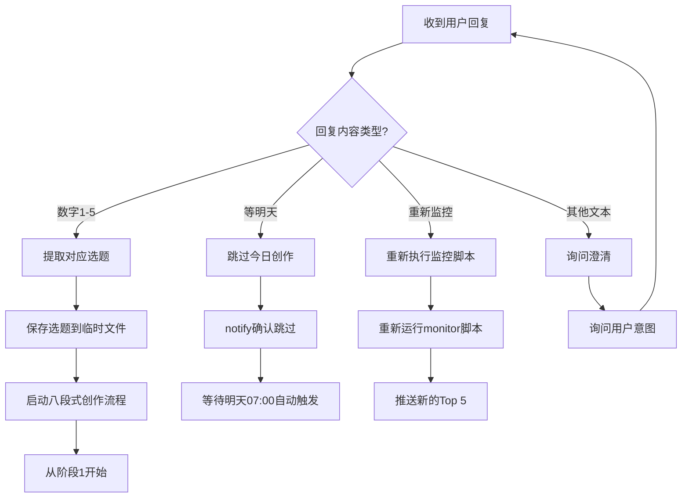

# AIContentFlow 决策树与用户交互逻辑

> **用途**：本文档定义AI Agent在不同用户输入下的决策逻辑，确保交互流畅且符合预期。

---

## 📋 目录

1. [热点监控后的用户回复处理](#1-热点监控后的用户回复处理)
2. [创作流程中的确认点](#2-创作流程中的确认点)
3. [异常输入处理](#3-异常输入处理)
4. [多轮对话上下文管理](#4-多轮对话上下文管理)

---

## 1. 热点监控后的用户回复处理

### 场景
热点监控完成后，通过`notify`推送Top 5选题，等待用户回复。

### 决策树



### 代码逻辑

```python
def handle_user_reply_after_monitor(user_input):
    """
    处理热点监控后的用户回复
    """
    # 去除首尾空格并转小写
    user_input_clean = user_input.strip().lower()
    
    # 判断是否为数字1-5
    if user_input_clean in ["1", "2", "3", "4", "5"]:
        topic_number = int(user_input_clean)
        return {
            "action": "start_creation",
            "topic_number": topic_number,
            "next_step": "extract_topic_and_confirm"
        }
    
    # 判断是否为"等明天"及其变体
    elif user_input_clean in ["等明天", "明天", "跳过", "不写了"]:
        return {
            "action": "skip_today",
            "next_step": "notify_and_wait_tomorrow"
        }
    
    # 判断是否为"重新监控"及其变体
    elif any(keyword in user_input_clean for keyword in ["重新监控", "刷新", "重新", "再来一次"]):
        return {
            "action": "re_monitor",
            "next_step": "run_monitor_script_again"
        }
    
    # 判断是否为直接提供的创作主题
    elif len(user_input) > 10 and any(keyword in user_input for keyword in ["写", "创作", "文章", "介绍"]):
        return {
            "action": "custom_topic",
            "custom_topic": user_input,
            "next_step": "confirm_custom_topic"
        }
    
    # 其他情况：询问澄清
    else:
        return {
            "action": "ask_clarification",
            "next_step": "wait_for_clear_instruction"
        }
```

### 回复模板

#### 情况1：用户回复数字1-5
```markdown
✅ **选题已确认：{topic_title}**

**主题**：{topic_description}
**类型**：{content_type}（科普/工具/编程/创业）
**目标字数**：{word_count_range}
**目标读者**：AI从业者、开发者、技术爱好者

**即将开始八段式创作流程**：
1. 确认选题和创作目标
2. 深度调研（≥15个信息源）
3. 内容创作（{word_count_range}字）
4. 三遍审校（事实核查、降AI味、排版润色）
5. 生成20个标题方案
6. 最终审阅与暂存
7. 制作配图
8. 发布推广

📋 **请回复"确认"开始创作，或提出修改建议。**
```

#### 情况2：用户回复"等明天"
```markdown
✅ **已跳过今日创作任务**

明天 07:00 将自动执行热点监控，届时再次推送选题。

🌙 今天好好休息！

---
💡 如果临时改变主意，随时可以说"执行AIContentFlow热点监控任务"重新开始。
```

#### 情况3：用户回复"重新监控"
```markdown
🔄 **正在重新执行热点监控...**

（等待脚本执行）

---
📊 **热点监控完成 - 新的Top 5选题**

{new_top5_topics}

请回复选题编号（1-5）确认创作，或回复'等明天'跳过。
```

#### 情况4：用户提供自定义主题
```markdown
💡 **收到自定义创作主题**

你提到："{user_input}"

我理解你想创作关于：**{extracted_topic}**

**建议设定**：
- 类型：{suggested_type}
- 目标字数：{word_count_range}
- 内容线：{suggested_content_line}

📋 **回复"确认"开始创作，或提供更多细节调整方向。**
```

#### 情况5：无法理解的回复
```markdown
❓ **抱歉，我没理解你的意思**

请：
- 回复 **1-5** 选择对应的选题
- 回复 **"等明天"** 跳过今日创作
- 回复 **"重新监控"** 刷新选题列表
- 或者直接告诉我你想创作的主题（如"写一篇关于xxx的文章"）

---
💡 如果有疑问，可以问我"AIContentFlow能做什么？"
```

---

## 2. 创作流程中的确认点

### 阶段1：确认选题和创作目标

**等待用户输入**：用户回复"确认"或提出修改

#### 决策逻辑：
```python
def handle_stage1_confirmation(user_input):
    user_input_clean = user_input.strip().lower()
    
    if user_input_clean in ["确认", "开始", "好", "ok", "继续"]:
        return {"action": "proceed_to_stage2"}
    
    elif any(keyword in user_input for keyword in ["修改", "调整", "改成"]):
        return {
            "action": "adjust_goal",
            "adjustment_request": user_input
        }
    
    else:
        return {"action": "ask_clarification"}
```

#### 回复模板：
**确认后**：
```markdown
✅ **开始阶段2：深度调研**

正在检索相关资料...
目标：收集≥15个高质量信息源

（执行检索）
```

**修改请求**：
```markdown
💡 **收到调整需求：{user_input}**

我将调整为：
- {adjustment_detail_1}
- {adjustment_detail_2}

调整后的设定是否OK？回复"确认"继续。
```

---

### 阶段2：深度调研完成

**等待用户输入**：用户回复"继续"或"补充调研"

#### 决策逻辑：
```python
def handle_stage2_confirmation(user_input):
    user_input_clean = user_input.strip().lower()
    
    if user_input_clean in ["继续", "开始写", "进入创作"]:
        return {"action": "proceed_to_stage3"}
    
    elif any(keyword in user_input for keyword in ["补充", "不够", "再查"]):
        return {
            "action": "supplement_research",
            "supplement_request": user_input
        }
    
    else:
        return {"action": "ask_clarification"}
```

---

### 阶段3：内容创作完成

**等待用户输入**：用户回复"继续"或"重写某部分"

#### 决策逻辑：
```python
def handle_stage3_confirmation(user_input):
    user_input_clean = user_input.strip().lower()
    
    if user_input_clean in ["继续", "审校", "开始审校"]:
        return {"action": "proceed_to_stage4"}
    
    elif any(keyword in user_input for keyword in ["重写", "修改"]):
        # 提取要修改的部分
        if "引子" in user_input or "开头" in user_input:
            section = "introduction"
        elif "核心" in user_input or "概念" in user_input:
            section = "core_concept"
        elif "技术" in user_input or "实现" in user_input:
            section = "technical_implementation"
        # ... 其他部分
        else:
            section = "unknown"
        
        return {
            "action": "rewrite_section",
            "section": section,
            "rewrite_request": user_input
        }
    
    else:
        return {"action": "ask_clarification"}
```

---

### 阶段4-6：三遍审校

每遍审校后都等待用户确认，决策逻辑类似：
- "继续" → 进入下一遍审校
- "再审某部分" → 重新审校指定部分
- "跳过" → 直接进入下一阶段（不推荐，需二次确认）

---

### 阶段7：标题创作完成

**等待用户输入**：用户选择标题编号或提出修改

#### 决策逻辑：
```python
def handle_stage7_confirmation(user_input):
    user_input_clean = user_input.strip()
    
    # 检查是否为数字1-20
    if user_input_clean.isdigit() and 1 <= int(user_input_clean) <= 20:
        title_number = int(user_input_clean)
        return {
            "action": "select_title",
            "title_number": title_number
        }
    
    # 检查是否为修改请求
    elif any(keyword in user_input for keyword in ["修改", "改", "不好"]):
        return {
            "action": "modify_title",
            "modification_request": user_input
        }
    
    # 检查是否为平台定制请求
    elif any(platform in user_input for platform in ["掘金", "知乎", "V2EX", "微信"]):
        return {
            "action": "platform_specific_title",
            "platform_request": user_input
        }
    
    else:
        return {"action": "ask_clarification"}
```

#### 回复模板：
**选择标题后**：
```markdown
✅ **标题已确定：{selected_title}**

现在进入阶段8：最终审阅与暂存

正在保存所有文件到：`/data/workspace/.draft/2026-02-24/`

（执行保存操作）
```

**修改标题**：
```markdown
💡 **收到标题修改需求：{user_input}**

我将生成3个新标题：
1. {new_title_1}
2. {new_title_2}
3. {new_title_3}

请选择编号或继续提出修改建议。
```

---

## 3. 异常输入处理

### 3.1 完全无法理解的输入

**触发条件**：
- 用户输入过短（<3个字符）
- 用户输入包含大量符号或乱码
- 用户输入与当前上下文完全无关

**处理策略**：
```markdown
❓ **抱歉，我没理解你的意思**

当前我们在：**{current_stage_name}**

可以：
- {option_1}
- {option_2}
- {option_3}

或者告诉我："从头开始"、"取消任务"、"查看进度"

---
💡 如需帮助，问我"现在在做什么？"
```

---

### 3.2 中途取消任务

**触发词**："取消"、"停止"、"不写了"、"算了"

**处理策略**：
```markdown
⚠️ **确认取消任务？**

当前进度：**{current_stage}**
已完成：{completed_stages}
已保存：{saved_files}

如果取消：
- 已完成的内容会保存到 `/data/workspace/.draft/incomplete_{date}/`
- 下次可以继续（回复"继续未完成任务"）
- 也可以彻底删除（回复"删除草稿"）

**回复"确认取消"继续，或"继续任务"返回创作。**
```

---

### 3.3 查看当前进度

**触发词**："进度"、"到哪了"、"现在在做什么"、"状态"

**处理策略**：
```markdown
## 📊 当前任务进度

**任务**：{task_name}
**选题**：{topic_title}

### ✅ 已完成
- [x] 阶段1：确认选题和创作目标
- [x] 阶段2：深度调研（15个信息源）
- [x] 阶段3：内容创作（5800字）

### 🔄 进行中
- [ ] **阶段4：第一遍审校 - 事实核查** ← 当前

### ⏳ 待完成
- [ ] 阶段5：第二遍审校 - 降AI味
- [ ] 阶段6：第三遍审校 - 排版润色
- [ ] 阶段7：标题创作（20个方案）
- [ ] 阶段8：最终审阅与暂存

---
**下一步**：完成事实核查后，回复"继续"进入阶段5。
```

---

### 3.4 跳过某个阶段

**触发词**："跳过"、"直接到xxx"

**处理策略**（不推荐跳过，需二次确认）：
```markdown
⚠️ **不推荐跳过审校阶段**

你想跳过：**{stage_to_skip}**

跳过此阶段可能导致：
- 文章质量下降
- 出现事实错误
- AI腔严重
- 排版不规范

**如果确实要跳过**，回复"确认跳过"。
**建议继续完成**，回复"继续审校"。
```

---

## 4. 多轮对话上下文管理

### 4.1 上下文信息存储

**临时文件**（保存在内存或临时文件）：
```json
{
  "current_workflow": "content_creation",
  "current_stage": 4,
  "stage_name": "第一遍审校 - 事实核查",
  "topic": {
    "number": 2,
    "title": "BMAD-METHOD：用大模型自动调试代码",
    "type": "编程",
    "word_count_target": "6000-8000"
  },
  "completed_stages": [1, 2, 3],
  "saved_files": [
    "/data/workspace/.draft/2026-02-24/article_draft.md",
    "/data/workspace/.draft/2026-02-24/research_notes.md"
  ],
  "waiting_for": "user_confirmation",
  "last_user_input": "继续",
  "last_agent_output": "阶段3创作完成通知"
}
```

### 4.2 上下文恢复

**场景**：用户中途离开，过几小时后回来

**检测方法**：
- 检查是否存在 `/data/workspace/.draft/latest/` 目录
- 读取 `context.json` 文件

**恢复提示**：
```markdown
👋 **欢迎回来！**

检测到未完成的任务：

**任务**：{task_name}
**选题**：{topic_title}
**当前进度**：{current_stage_name}
**上次活动**：{last_activity_time}

**是否继续？**
- 回复"继续"从上次进度继续
- 回复"重新开始"放弃当前进度，开始新任务
- 回复"查看详情"了解更多
```

---

### 4.3 上下文切换

**场景**：用户在创作任务进行中，突然要求执行其他操作（如"查看GitHub仓库"）

**处理策略**：
```markdown
💡 **收到新请求：{new_request}**

当前有进行中的任务：**{current_task_name}**（阶段{current_stage}）

**选项**：
1. **暂停当前任务，处理新请求**（推荐）
   - 当前进度会自动保存
   - 处理完新请求后可继续

2. **取消当前任务**
   - 已完成的内容会保存到草稿
   - 开始新任务

3. **继续当前任务，稍后处理新请求**
   - 先完成当前阶段
   - 稍后提醒你处理新请求

**请回复数字1、2或3。**
```

---

## 🔗 相关文档

- [工作流标准操作流程](./WORKFLOW_SOP.md)
- [Prompt模板库](./PROMPT_TEMPLATES.md)
- [示例对话](./EXAMPLE_CONVERSATION.md)

---

**文档版本**：v1.0  
**最后更新**：2026-02-24  
**维护者**：cosysun