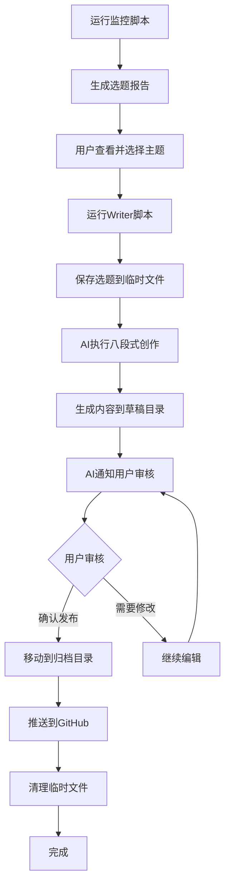

# AIContentFlow 使用指南（手动触发模式）

## 🎯 工作流程概览

```
用户运行监控 → 查看选题报告 → 确认主题 → 运行内容生成 → 审核发布
```

**重要变更**：系统已移除所有定时任务，改为用户完全主动控制执行时机。

---

## 📋 三种使用方式

### 方式一：分步执行（推荐）⭐

#### 步骤1：运行热点监控
```bash
bash /data/workspace/AIContentFlow/run_monitor.sh
```

**输出内容：**
- 生成报告：`/data/workspace/AIContentFlow/outputs/topic_monitor_report.md`
- 显示前30行预览
- 提示下一步操作

#### 步骤2：查看完整报告
```bash
cat /data/workspace/AIContentFlow/outputs/topic_monitor_report.md
```

或使用less分页查看：
```bash
less /data/workspace/AIContentFlow/outputs/topic_monitor_report.md
```

#### 步骤3：运行内容生成
```bash
bash /data/workspace/AIContentFlow/run_writer.sh "你选择的主题名称"
```

**示例：**
```bash
bash /data/workspace/AIContentFlow/run_writer.sh "Claude 3.5新功能深度解析"
```

---

### 方式二：完整流程（交互式）

```bash
bash /data/workspace/AIContentFlow/run_full.sh
```

系统会：
1. 自动运行监控
2. 显示报告预览
3. 提示你输入主题名称
4. 自动启动内容生成流程

---

### 方式三：直接调用Python脚本

#### 仅运行监控：
```bash
cd /data/workspace/AIContentFlow/monitor
python3 aicontentflow_monitor.py
```

#### 运行内容生成（需先在对话中告知AI）：
在对话中发送：
```
请执行内容创作任务，主题为：[主题名称]

使用八段式专业写作工作流完整执行...
（具体指令见run_writer.sh脚本输出）
```

---

## 🗂️ 文件位置说明

### 输出目录
```
/data/workspace/AIContentFlow/outputs/
├── topic_monitor_report.md          # 最新监控报告（固定文件名）
├── topic_monitor_report.json        # JSON格式数据
└── topic_monitor_report_20260221.md # 带时间戳的备份
```

### 草稿目录
```
/data/workspace/.draft/YYYY-MM-DD/
└── [主题名称]/
    ├── article.md           # 文章正文
    ├── metadata.json        # 元数据
    └── promotion_plan.md    # 推广计划
```

### 最终归档
```
/data/workspace/AI-Content-Archive/output/YYYY-MM-DD/
```

---

## ⚡ 快速命令参考

### 查看最近的监控报告
```bash
cat /data/workspace/AIContentFlow/outputs/topic_monitor_report.md
```

### 查看历史报告（带时间戳的）
```bash
ls -lt /data/workspace/AIContentFlow/outputs/topic_monitor_report_*.md
```

### 检查今日是否已有草稿
```bash
ls /data/workspace/.draft/$(date +%Y-%m-%d)/
```

### 查看已归档的内容
```bash
ls /data/workspace/AI-Content-Archive/output/
```

---

## 🔍 故障排查

### 问题1：监控脚本运行失败
**检查Brave Search API配置：**
```bash
grep "BRAVE_API_KEY" /data/workspace/AIContentFlow/monitor/aicontentflow_monitor.py
```

应该显示：
```python
BRAVE_API_KEY = ""  # 需要通过环境变量设置
```

### 问题2：报告文件未生成
**检查输出目录权限：**
```bash
ls -ld /data/workspace/AIContentFlow/outputs/
```

**手动创建目录：**
```bash
mkdir -p /data/workspace/AIContentFlow/outputs
```

### 问题3：内容生成无响应
确保：
1. 已保存选题到 `/data/workspace/.daily_topic_choice.txt`
2. 在对话中明确告知AI要执行的任务
3. 使用完整的八段式工作流指令

---

## 📊 数据源状态检查

当前配置的6个数据源：

| 数据源 | 状态 | 说明 |
|--------|------|------|
| 36氪 | ✅ 正常 | 科技资讯 |
| 虎嗅 | ✅ 正常 | 商业分析 |
| 少数派 | ✅ 正常 | 数字生活 |
| 机器之心 | ✅ 正常 | AI学术 |
| InfoQ | ✅ 正常 | 技术深度 |
| Brave Search | ✅ 已配置 | 全网搜索 |

---

## 🎯 最佳实践

### 建议执行时间
- **早上**：运行监控，获取最新热点
- **上午**：确认选题，启动内容创作
- **下午**：审核内容，准备发布

### 选题标准
- ✅ 热度高（搜索量大）
- ✅ 时效性强（24小时内）
- ✅ 符合内容线定位
- ✅ 有深度创作空间
- ✅ 目标受众明确

### 内容质量检查
- 字数达标（根据内容线）
- AI味评分 < 30%
- 事实核查通过
- 排版规范
- 有独特观点

---

## 🔄 工作流程图



---

## 📞 需要帮助？

遇到问题时：
1. 查看本指南的故障排查部分
2. 检查 `/data/workspace/AIContentFlow/logs/` 日志
3. 向AI描述具体问题和错误信息

---

**更新时间**：2026-02-21  
**版本**：v2.0 (手动触发模式)  
**项目位置**：`/data/workspace/AIContentFlow/`