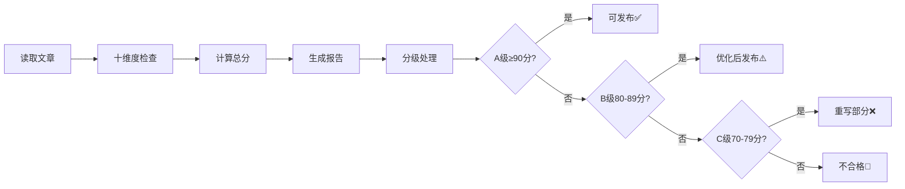

# AIContentFlow 质检流程快速参考

> **一页纸搞懂质检流程**

---

## 🎯 什么时候质检？

**自动触发**：阶段8（最终审阅）完成后
**手动触发**：任何时候说"质检"、"评估文章质量"

---

## 📊 评分标准（一句话版）

| 维度 | 核心要求 | 扣分重点 |
|------|---------|---------|
| **技术准确性**(15%) | 数据有来源、代码能运行 | 无依据数据-2分、错误代码-3分 |
| **逻辑连贯性**(10%) | 章节合理、论证清晰 | H1≠1个-1分、逻辑跳跃-1分 |
| **内容完整性**(10%) | 字数≥3000、有案例 | <2000字-3分、无案例-1分 |
| **代码质量**(10%) | 有语言标注、符合规范 | 未标注-0.5分/个、Tab缩进-0.5分 |
| **可读性**(10%) | 段落≤5行、有类比 | 超长段落-0.5分/个、无术语解释-0.5分 |
| **实用性**(10%) | 有实战案例、资源链接 | 无案例-3分、链接<3个-1分 |
| **格式规范**(10%) | Markdown正确、排版美观 | 中英文无空格-1分、标点混用-0.5分 |
| **降AI味**(10%) | 零套话、少过渡词 | 套话-0.5~1分/次、过渡词过多-1分 |
| **SEO优化**(10%) | H1唯一、H2 3-10个 | H2<3个-1分、无Meta-1分 |
| **创新性**(5%) | 独特视角、新颖案例 | 主观打分7-10分 |

---

## ⭐ 评级标准

```
A级（≥90分）✅ → 可发布
B级（80-89分）⚠️ → 建议优化后发布
C级（70-79分）❌ → 需重写部分内容
D级（<70分）🚫 → 不建议发布
```

---

## 🚀 快速使用

### 方法1：命令行
```bash
python3 /data/workspace/AIContentFlow/tools/quality_checker.py <文章路径>
```

### 方法2：集成工作流
```
阶段8完成后：
系统提示："回复'开始质检'执行全方位质检"
你回复："开始质检"
系统自动执行并生成报告
```

### 方法3：手动触发
```
任何时候对我说：
"帮我质检这篇文章"
"全方位评估文章质量"
"执行AIContentFlow质检"
```

---

## 📋 质检流程（5步）



---

## 🔴 必修问题（高优先级）

**立即修复以下问题才能发布**：

1. **事实错误**（数据/技术描述错误）
2. **代码不可运行**（关键示例无法执行）
3. **逻辑严重混乱**（论证不通）
4. **标题党**（标题与内容不符）

---

## 🟡 建议修复（中优先级）

**影响质量但不致命**：

1. 内容不完整（缺少关键章节）
2. 案例不足（理论多实践少）
3. AI腔严重（套话过多）
4. 格式问题（Markdown错误）

---

## 🟢 可选优化（低优先级）

**锦上添花**：

1. SEO优化（关键词密度）
2. 视觉美化（emoji、表格）
3. 创新性提升（独特视角）
4. 传播优化（标题微调）

---

## 🎯 常见问题速查

### Q1: 质检分数太低怎么办？

| 分数段 | 建议操作 |
|-------|---------|
| D级(<70) | 重新选题或从阶段2重新开始 |
| C级(70-79) | 重写得分最低的3个维度 |
| B级(80-89) | 修复高优先级问题即可 |
| A级(≥90) | 可选优化，可直接发布 |

### Q2: 哪些维度最容易失分？

根据测试数据：
1. **降AI味**（套话检测严格）
2. **代码质量**（标注语言常被忽略）
3. **可读性**（段落过长问题）
4. **格式规范**（中英文间距）

### Q3: 如何快速提升到A级？

**4个最有效的优化**：
1. 清除所有AI套话（+3-5分）
2. 给所有代码块标注语言（+5分）
3. 拆分超长段落（≤5行/段）（+2-3分）
4. 修复中英文间距（+1分）

### Q4: 质检可以跳过吗？

**可跳过情况**：
- 短篇快讯（<2000字）
- 内部分享（非正式发布）
- 时效性极高（需立即发布）
- 同类型文章已多次A级

**必须质检情况**：
- 首次创作该类型
- 技术细节复杂的文章
- 准备广泛传播的重要内容
- 用户明确要求

---

## 📝 质检报告示例

```markdown
📊 质检结果总览
- 综合评分：96/100 ⭐⭐⭐⭐⭐
- 评级：A级（可发布）
- 推荐发布：是 ✅

🎯 各维度得分
技术准确性: 10.0/10 ⭐⭐⭐⭐⭐
逻辑连贯性: 10.0/10 ⭐⭐⭐⭐⭐
内容完整性:  9.0/10 ⭐⭐⭐⭐⭐
代码质量  : 10.0/10 ⭐⭐⭐⭐⭐
可读性    : 10.0/10 ⭐⭐⭐⭐⭐
实用性    : 10.0/10 ⭐⭐⭐⭐⭐
格式规范  :  9.0/10 ⭐⭐⭐⭐
降AI味   : 10.0/10 ⭐⭐⭐⭐⭐
SEO优化  :  9.0/10 ⭐⭐⭐⭐
创新性    :  9.0/10 ⭐⭐⭐⭐

✅ 核心优势
1. 技术深度专业
2. 代码示例丰富可用
3. 语言自然无AI腔

⚠️ 改进建议（可选）
1. 补充MCP安全性细节（+1分）
2. 增加Skills市场说明（+0.5分）
```

---

## 🛠️ 自动修复工具（未来）

**计划开发**：
- [ ] AI腔自动替换
- [ ] 代码块自动标注
- [ ] 段落自动拆分
- [ ] 间距自动修复
- [ ] 一键优化功能

---

## 📚 相关文档

- 完整质检标准：[QUALITY_CHECK_WORKFLOW.md](./QUALITY_CHECK_WORKFLOW.md)
- 工作流SOP：[WORKFLOW_SOP.md](./WORKFLOW_SOP.md)
- AI Agent指南：[FOR_AI_AGENT.md](./FOR_AI_AGENT.md)

---

**版本**：v1.0  
**更新**：2026-02-25  
**维护**：cosysun
