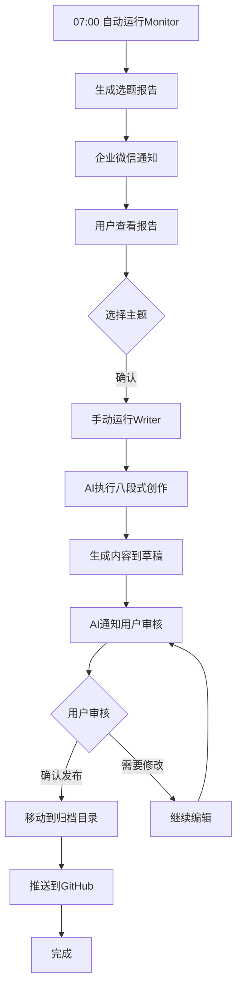

# AIContentFlow 使用指南（混合模式）

## 🎯 工作流程概览

```
每天07:00自动监控 → 企业微信通知 → 用户查看报告 → 手动启动Writer → 审核发布
```

**工作模式**：
- ✅ **Monitor（自动）** - 每天07:00自动运行，生成选题报告并通知
- 👤 **Writer（手动）** - 用户确认主题后手动触发创作流程

---

## 📋 每日工作流程

### 步骤1：自动监控（07:00）⏰

**系统自动执行**：
- 🤖 每天07:00系统自动运行监控脚本
- 📊 抓取6个数据源的热点信息
- 📝 生成选题报告
- 📱 通过企业微信通知你

**你会收到**：
- 通知标题：📊 热点监控完成 - 请查看选题
- 报告位置：`/data/workspace/AIContentFlow/outputs/topic_monitor_report.md`

### 步骤2：查看报告（07:00之后）

```bash
# 查看完整报告
cat /data/workspace/AIContentFlow/outputs/topic_monitor_report.md

# 或使用分页查看
less /data/workspace/AIContentFlow/outputs/topic_monitor_report.md
```

### 步骤3：选择主题（任意时间）

从报告中选择你感兴趣的主题，记下主题名称。

### 步骤4：手动启动创作（任意时间）👤

#### 方式A：使用便捷脚本（推荐）⭐

```bash
bash /data/workspace/AIContentFlow/run_writer.sh "你选择的主题名称"
```

**示例**：
```bash
bash /data/workspace/AIContentFlow/run_writer.sh "Claude 3.5新功能深度解析"
```

#### 方式B：在对话中告知AI

直接在对话中发送：
```
请执行内容创作任务，主题为：[主题名称]

使用八段式专业写作工作流完整执行：
- 阶段1：确认选题和创作目标
- 阶段2：深度调研（15+信息源）
- 阶段3：内容创作（根据内容线字数要求）
- 阶段4：三遍审校（事实核查+降AI味+排版润色）
- 阶段5：拟定20个标题方案
- 阶段6：最终审阅
- 阶段7：暂存到临时目录
- 阶段8：生成发布推广计划

完成后使用notify工具通知我。
```

### 步骤5：等待创作完成（15-30分钟）

AI执行八段式创作流程，你会收到企业微信通知：
- 通知标题：📝 内容已完成 - 请确认发布

### 步骤6：审核并发布

查看生成的内容，确认后发布到GitHub。

---

## ⏰ 定时任务说明

### 当前配置

| 任务名称 | 执行时间 | 执行内容 | 状态 |
|---------|---------|---------|------|
| AIContentFlow-Monitor | 每天07:00 | 热点监控，生成选题报告 | ✅ 已启用 |
| ~~AIContentFlow-Writer~~ | ~~每天08:00~~ | ~~自动内容生成~~ | ❌ 已移除 |

### 为什么这样设计？

**自动监控的优势**：
- ⏰ 每天固定时间获取最新热点
- 📊 无需记得手动运行
- 🔄 保持内容新鲜度

**手动创作的优势**：
- 🎯 充分考虑选择最合适的主题
- ⏳ 不受时间压力，可随时启动
- 🎮 完全控制创作时机

---

## 🔧 手动执行选项（可选）

如果你想在非07:00时间也运行监控：

### 额外运行一次监控

```bash
bash /data/workspace/AIContentFlow/run_monitor.sh
```

或直接调用Python脚本：

```bash
cd /data/workspace/AIContentFlow/monitor
python3 aicontentflow_monitor.py
```

---

## 📁 文件位置说明

### 输出目录
```
/data/workspace/AIContentFlow/outputs/
├── topic_monitor_report.md          # 最新监控报告（固定文件名）
├── topic_monitor_report.json        # JSON格式数据
└── topic_monitor_report_20260221.md # 带时间戳的备份
```

### 草稿目录
```
/data/workspace/.draft/YYYY-MM-DD/
└── [主题名称]/
    ├── article.md           # 文章正文
    ├── metadata.json        # 元数据
    └── promotion_plan.md    # 推广计划
```

### 最终归档
```
/data/workspace/AI-Content-Archive/output/YYYY-MM-DD/
```

---

## ⚡ 快速命令参考

### 查看今日报告
```bash
cat /data/workspace/AIContentFlow/outputs/topic_monitor_report.md
```

### 查看历史报告
```bash
ls -lt /data/workspace/AIContentFlow/outputs/topic_monitor_report_*.md
```

### 手动运行监控（可选）
```bash
bash /data/workspace/AIContentFlow/run_monitor.sh
```

### 启动内容创作
```bash
bash /data/workspace/AIContentFlow/run_writer.sh "主题名称"
```

### 查看今日草稿
```bash
ls /data/workspace/.draft/$(date +%Y-%m-%d)/
```

### 查看已归档内容
```bash
ls /data/workspace/AI-Content-Archive/output/
```

---

## 📊 数据源状态

当前配置的6个数据源：

| 数据源 | 状态 | 说明 |
|--------|------|------|
| 36氪 | ✅ 正常 | 科技资讯 |
| 虎嗅 | ✅ 正常 | 商业分析 |
| 少数派 | ✅ 正常 | 数字生活 |
| 机器之心 | ✅ 正常 | AI学术 |
| InfoQ | ✅ 正常 | 技术深度 |
| Brave Search | ✅ 已配置 | 全网搜索（API Key已配置）|

---

## 🔍 故障排查

### 问题1：未收到07:00的通知

**可能原因**：
- 定时任务未启用
- 企业微信通知未配置

**解决方案**：
```bash
# 手动运行一次检查
bash /data/workspace/AIContentFlow/run_monitor.sh
```

### 问题2：报告文件未生成

**检查输出目录**：
```bash
ls -la /data/workspace/AIContentFlow/outputs/
```

**手动创建目录**：
```bash
mkdir -p /data/workspace/AIContentFlow/outputs
```

### 问题3：Brave Search API不工作

**检查配置**：
```bash
grep "BRAVE_API_KEY" /data/workspace/AIContentFlow/monitor/aicontentflow_monitor.py
```

应该显示：
```python
BRAVE_API_KEY = ""  # 需要通过环境变量设置
```

---

## 🎯 最佳实践

### 推荐时间安排

```
07:00-07:05   系统自动监控（无需操作）
07:10-07:30   查看报告，选择主题
11:00-12:00   启动内容创作
15:00-17:00   审核内容，确认发布
```

### 选题标准

- ✅ 热度高（多个数据源都提到）
- ✅ 时效性强（24小时内的热点）
- ✅ 符合内容线定位
- ✅ 有深度创作空间
- ✅ 目标受众明确

### 内容质量检查

- ✅ 字数达标（根据内容线）
- ✅ AI味评分 < 30%
- ✅ 事实核查通过
- ✅ 排版规范
- ✅ 有独特观点和价值

---

## 🔄 工作流程图



---

## 📞 需要帮助？

### 查看文档

```bash
# 快速启动卡片
cat /data/workspace/AIContentFlow/QUICK_START.txt

# 主文档
cat /data/workspace/AIContentFlow/README.md

# 查看定时任务
# （向AI发送：列出所有定时任务）
```

### 常见问题

**Q: 如何临时暂停自动监控？**
A: 向AI说"暂停AIContentFlow-Monitor定时任务"

**Q: 如何在非07:00时间也获取热点？**
A: 运行 `bash /data/workspace/AIContentFlow/run_monitor.sh`

**Q: Writer可以随时运行吗？**
A: 是的，选择主题后任何时间都可以运行Writer

**Q: 报告会覆盖吗？**
A: 不会，系统会生成带时间戳的备份文件

---

**更新时间**：2026-02-21  
**版本**：v2.1 (混合模式：自动监控 + 手动创作)  
**项目位置**：`/data/workspace/AIContentFlow/`